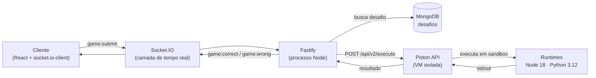

<h1 align="center">CodeSurv — Backend</h1>

<p align="center">
  API e servidor de tempo real do <strong>CodeSurv</strong>, um jogo multiplayer de desafios de programação por salas.
</p>

<p align="center">
  
  
  
  
  
  
</p>

<p align="center">
  <a href="#como-rodar">Como rodar</a> ·
  <a href="#arquitetura">Arquitetura</a> ·
  <a href="#eventos-socketio">Eventos</a> ·
  <a href="#criando-desafios">Desafios</a> ·
  <a href="https://github.com/SergioGuthyerres/CodeSurv-Frontend">Frontend ↗</a>
</p>

---

## O que é

CodeSurv é um *casual coding game*: jogadores entram numa sala, recebem o mesmo desafio de
lógica e competem para resolvê-lo primeiro. Este repositório é o servidor — ele orquestra as
salas, sorteia os desafios, cronometra os rounds, pontua e **executa o código enviado pelos
jogadores dentro de um sandbox**.

O estado das salas ativas vive **em memória**, num `Map` do próprio processo Node — sem Redis
no caminho do tempo real. O MongoDB guarda apenas os desafios (e, futuramente, o histórico de
partidas).

---

## Arquitetura

O ponto mais interessante do projeto é a execução de código não confiável. O servidor nunca
roda a solução do jogador no próprio processo: ele monta o código completo, manda para uma
instância da [Piston](https://github.com/engineer-man/piston) — um sandbox de execução isolado,
hospedado numa VM separada — e compara o `stdout` com o resultado esperado.



**Por que um sandbox externo:** a solução do jogador é código arbitrário. Executá-la com `eval`
ou `child_process` no mesmo processo do servidor significaria dar acesso ao sistema de arquivos,
à rede e às variáveis de ambiente da aplicação. A Piston roda cada execução num container
com limites de CPU, memória e tempo, numa máquina que não é a do servidor de jogo.

**Fluxo de uma submissão:**

1. O jogador envia `game:submit` com a solução e a linguagem.
2. `judgeServices.evaluateSolution` concatena o `functionSig` do desafio com o corpo escrito
   pelo jogador, montando um programa completo.
3. Para cada caso de teste, o programa é enviado a `POST {PISTON_URL}/api/v2/execute`.
4. O `stdout` é comparado com o `expected` via `JSON.stringify` — tipo importa.
5. Um caso que falha encerra a avaliação: a submissão é incorreta.

Código montado para JavaScript:

```javascript
function solve(a, b){ /* solução do jogador */ }
console.log(JSON.stringify(solve(1, 2)))
```

Código montado para Python:

```python
def solve(a, b):
    # solução do jogador
import json
print(json.dumps(solve(1, 2)))
```

---

## Stack

| Tecnologia  | Uso                                      |
|-------------|------------------------------------------|
| Node.js 20+ | Runtime                                  |
| TypeScript  | Tipagem estática                         |
| Fastify 5   | Servidor HTTP                            |
| Socket.IO 4 | Comunicação em tempo real                |
| MongoDB 7   | Desafios e (futuramente) histórico       |
| Mongoose    | ODM e schemas                            |
| Piston      | Sandbox de execução de código            |
| tsx         | Execução e hot reload em desenvolvimento |

---

## Como rodar

### Opção 1 — Docker Compose (recomendado)

Sobe MongoDB e Piston já configurados, com os runtimes de JavaScript e Python instalados:

```bash
cp .env.example .env
docker compose up -d
npm install
npm run seed     # popula o banco com os desafios iniciais
npm run dev
```

O servidor sobe em `http://localhost:3000`. Veja [`docker-compose.yml`](docker-compose.yml)
para detalhes dos serviços.

### Opção 2 — Serviços locais

Requer Node.js 20+, MongoDB em execução e uma instância da Piston acessível.

```bash
cp .env.example .env   # ajuste MONGO_URI e PISTON_URL
npm install
npm run seed
npm run dev
```

<details>
<summary><strong>Subindo a Piston manualmente</strong></summary>

```bash
docker run -d --name piston --restart always --privileged \
  -p 2000:2000 -v piston-data:/piston ghcr.io/engineer-man/piston
```

Com o container no ar, instale os runtimes:

```bash
curl -X POST http://localhost:2000/api/v2/packages \
  -H "Content-Type: application/json" \
  -d '{"language": "javascript", "version": "18.15.0"}'

curl -X POST http://localhost:2000/api/v2/packages \
  -H "Content-Type: application/json" \
  -d '{"language": "python", "version": "3.12.0"}'
```

Confirme que ficaram ativos:

```bash
curl http://localhost:2000/api/v2/runtimes
```

Se a Piston estiver em outra máquina, aponte `PISTON_URL` para o IP dela.
</details>

### Variáveis de ambiente

| Variável       | Padrão                               | Descrição                          |
|----------------|--------------------------------------|------------------------------------|
| `PORT`         | `3000`                               | Porta do servidor                  |
| `MONGO_URI`    | `mongodb://localhost:27017/codesurv` | Conexão com o MongoDB              |
| `FRONTEND_URL` | `http://localhost:5173`              | Origem liberada no CORS            |
| `PISTON_URL`   | `http://localhost:2000`              | Base da API da Piston              |

### Scripts

```bash
npm run dev        # servidor com hot reload
npm run build      # compila para dist/
npm start          # roda o build
npm run typecheck  # tsc --noEmit
npm test           # suíte de testes (node:test + tsx)
npm run seed       # popula o banco com desafios
```

---

## Eventos Socket.IO

### Sala — cliente → servidor

| Evento        | Payload                                                      | Descrição               |
|---------------|--------------------------------------------------------------|-------------------------|
| `room:create` | `{ username, maxPlayers, timeLimit, pointsToWin, password? }` | Cria uma sala           |
| `room:join`   | `{ code, username, password? }`                              | Entra em uma sala       |
| `room:leave`  | —                                                            | Sai da sala atual       |
| `room:list`   | —                                                            | Lista salas disponíveis |

### Sala — servidor → cliente

| Evento          | Payload        | Descrição                 |
|-----------------|----------------|---------------------------|
| `room:created`  | `Room`         | Sala criada com sucesso   |
| `room:joined`   | `Room`         | Entrou na sala            |
| `room:updated`  | `Room`         | Estado da sala atualizado |
| `room:userLeft` | `{ socketId }` | Um jogador saiu           |
| `room:list`     | `PublicRoom[]` | Salas em espera           |
| `room:error`    | `string`       | Código de erro            |

### Jogo — cliente → servidor

| Evento        | Payload                        | Descrição                    |
|---------------|--------------------------------|------------------------------|
| `game:start`  | `{ code }`                     | Inicia o jogo (somente dono) |
| `game:submit` | `{ code, solution, language }` | Envia solução                |

### Jogo — servidor → cliente

| Evento             | Payload                               | Descrição                        |
|--------------------|---------------------------------------|----------------------------------|
| `game:started`     | `{ challenge, roundEndsAt }`          | Round iniciado                   |
| `game:correct`     | `{ username, score, players }`        | Solução correta                  |
| `game:wrong`       | `{ error? }`                          | Solução incorreta                |
| `game:roundEnd`    | `{ challenge, roundEndsAt, players }` | Round encerrado, próximo desafio |
| `game:end`         | `{ winner, players }`                 | Partida encerrada                |
| `game:interrupted` | `{ socketId }`                        | Jogo interrompido                |
| `game:error`       | `string`                              | Código de erro                   |

### Códigos de erro

| Código               | Origem    | Significado                              |
|----------------------|-----------|------------------------------------------|
| `roomNotFound`       | sala/jogo | Código de sala inválido                  |
| `invalidUsername`    | sala      | Nickname fora de 4–12 caracteres alfanum.|
| `invalidMaxPlayers`  | sala      | Jogadores fora do intervalo [2, 20]      |
| `invalidTimeLimit`   | sala      | Tempo fora do intervalo [60, 1000]       |
| `invalidPointsToWin` | sala      | Pontos fora do intervalo [80, 500]       |
| `roomFull`           | sala      | Sala cheia                               |
| `roomLimit`          | sala      | Limite de 300 salas simultâneas atingido |
| `incorrectPassword`  | sala      | Senha errada                             |
| `gameAlreadyStarted` | sala      | Partida em andamento                     |
| `permissionDenied`   | jogo      | Apenas o dono pode iniciar               |
| `noChallenge`        | jogo      | Banco sem desafios — rode `npm run seed` |
| `judgeUnavailable`   | jogo      | Piston inacessível                       |
| `solutionTooLarge`   | jogo      | Solução acima de 8000 caracteres         |
| `invalidPayload`     | jogo      | Payload de submissão malformado          |

---

## Regras do jogo

**Validações de sala**

- `maxPlayers`: 2–20
- `timeLimit`: 60–1000 segundos
- `pointsToWin`: 80–500
- Máximo de 300 salas simultâneas
- O código da sala (4 letras maiúsculas) é sempre gerado pelo servidor

**Pontuação**

```
Acerto: 10 pontos base
Bônus de velocidade por ordem de acerto no round:
  1º +10 · 2º +8 · 3º +6 · 4º +4 · 5º em diante +2
Erro ou timeout: 0 pontos
```

**Ciclo de um round**

1. O dono emite `game:start`.
2. O servidor sorteia um desafio no MongoDB e agenda o fim do round com `timeLimit`.
3. Jogadores enviam `game:submit`.
4. `judgeServices` avalia na Piston e aplica o bônus por ordem de acerto.
5. Quando todos acertam ou o tempo esgota, `handleRoundEnd` verifica se alguém atingiu
   `pointsToWin`.
6. Se sim, emite `game:end`. Se não, o próximo round começa automaticamente.

---

## Estrutura

```
src/
├── server.ts                # Entry point: Fastify + Socket.IO + MongoDB
├── db.ts                    # Conexão com o MongoDB
├── models/
│   ├── Challenge.ts         # Schema de desafio
│   └── Match.ts             # Schema de partida (histórico, ainda não usado)
├── services/
│   ├── roomServices.ts      # Validação, criação e entrada em salas
│   └── judgeServices.ts     # Avaliação de soluções via Piston
├── socket/
│   ├── index.ts             # Registro dos handlers por conexão
│   ├── roomHandlers.ts      # Eventos de sala
│   └── gameHandlers.ts      # Eventos de jogo e ciclo de rounds
├── store/
│   └── rooms.ts             # Estado das salas em memória (Map)
└── scripts/
    └── seedChallenge.ts     # Popula o banco com desafios

tests/                       # Suíte com node:test
docs/                        # Prompt de geração de desafios e registro dos inseridos
```

---

## Decisões de arquitetura

- **Sem Redis** — o estado das salas vive num `Map` no processo Node. Simplifica o MVP ao
  custo de não escalar horizontalmente; trocar por Redis é uma mudança localizada em
  `store/rooms.ts`.
- **Sem sistema de *ready*** — o dono inicia a partida quando quiser.
- **Código da sala gerado pelo servidor** — nunca escolhido pelo usuário, evita colisão e
  enumeração.
- **Rounds ilimitados** — a partida dura até alguém atingir `pointsToWin`.
- **Sem autenticação no MVP** — o jogador é apenas um username por conexão.
- **Persistência de partidas adiada** — `models/Match.ts` já existe, mas ainda não é gravado.

---

## Criando desafios

Os desafios ficam no MongoDB e entram pelo script de seed. O schema:

```typescript
interface Challenge {
  title: string;
  description: string;
  difficulty: "easy" | "medium" | "hard";
  tags: string[];
  languages: Array<"javascript" | "python">;
  functionSig: {
    javascript?: string; // abre a função e não fecha: "function solve(a, b){"
    python?: string;     // termina em dois-pontos: "def solve(a, b):"
  };
  testCases: {
    input: any[];        // sempre array, mesmo com um parâmetro: [5], não 5
    expected: any;
    isPublic: boolean;   // false = caso oculto, usado só na avaliação
  }[];
}
```

### Regras do `functionSig`

O `judgeServices` concatena a assinatura com o corpo escrito pelo jogador, então cada
linguagem tem um formato:

| Linguagem  | `functionSig`            | Jogador escreve  | Código final                          |
|------------|--------------------------|------------------|---------------------------------------|
| JavaScript | `function solve(a, b){`  | `return a + b;`  | `function solve(a, b){ return a + b; }` |
| Python     | `def solve(a, b):`       | `return a + b`   | `def solve(a, b):\n    return a + b`  |

### Regras dos `testCases`

- `input` é sempre um array.
- `expected` é comparado via `JSON.stringify` — `1` e `"1"` são valores diferentes.
- Recomendado: 3 casos públicos e 3 ou mais ocultos, para evitar solução *hardcoded*.
- Casos ocultos devem cobrir *edge cases*: negativos, zeros, vazios.

### Adicionando um desafio

Edite `src/scripts/seedChallenge.ts` e rode:

```bash
npm run seed
```

Para gerar desafios novos no formato correto, use o prompt em
[`docs/prompt-desafios.md`](docs/prompt-desafios.md). Antes de inserir, teste a solução
manualmente na Piston e confirme que o output bate com o `expected`.

---

## Estado atual

MVP em desenvolvimento. Funciona de ponta a ponta: criar sala → entrar → iniciar → submeter →
vencer, com desafios em JavaScript e Python avaliados na Piston.

Não implementado ainda: autenticação, persistência de partidas e estatísticas de jogador. O
que está planejado vira [issue](https://github.com/SergioGuthyerres/CodeSurv-Backend/issues) —
não roadmap no README.

---

## Relacionado

[**CodeSurv-Frontend**](https://github.com/SergioGuthyerres/CodeSurv-Frontend) — interface React
do jogador: home, lista de salas, lobby e tela de jogo.
